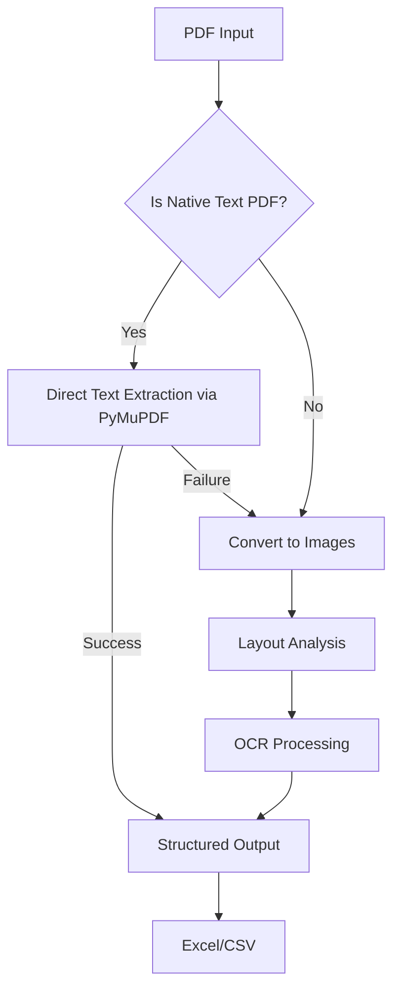

# Workflow Overview

## 1. Input Phase

User Input:
CLI (src/cli.py) or programmatic call initiates the pipeline with PDF paths.

Configuration Loaded:
configs/*.yaml files define OCR, layout, and stamp detection settings.

## 2. Preprocessing

| File | Action |
|---- | -----|
| src/preprocessing/pdf_to_image.py | Converts scanned/handwritten PDFs to images |
| src/preprocessing/image_enhancement.py | Enhances image quality for OCR (denoising, binarization) |

## 3. Data Extraction

| File | Action |
|--------- | ------|
| src/extraction/layout_analysis.py | Detects text regions (headings, paragraphs, tables) using LayoutParser |
| src/extraction/text_extraction.py | Runs OCR (Tesseract/EasyOCR) on text regions |
| src/extraction/table_handling.py | Reconstructs tables from OCR data |

## 4. Stamp/Signature Handling

| File | Action|
|---- | -----|
|scripts/train_stamp_detector.py | (Optional) Trains YOLOv5 model on custom stamp data |
| src/extraction/text_extraction.py | Filters out detected stamps (via bounding boxes) |

## 5. Postprocessing

| File | Action |
|----- | -------|
| src/postprocessing /text_cleaner.py | Removes OCR artifacts and gibberish text |
| src/postprocessing/structure_data.py | Organizes data into structured tables (1-column for paragraphs) |

## 6. Output Generation

| File | Action |
|---- | -----|
| src/pipeline/batch_processor.py | Manages parallel processing and output aggregation |
| src/postprocessing/structure_data.py | Exports final data to Excel (Data + Images tabs)|

## 7. Utilities & Error Handling

| File | Action |
|---- | -----|
| src/utils/retry.py | Retries failed operations (OCR, PDF parsing) |
| src/utils/logger.py | Logs progress and errors |
| src/utils/config_loader.py | Centralizes configuration management |

# End-to-End Flow

# Key Interactions

## Batch Processing

batch_processor.py orchestrates parallel execution using multiprocessing.Pool, calling all extraction/postprocessing modules.

## Error Recovery

retry.py wraps unstable operations (e.g., OCR) with exponential backoff.

# Structure

pdf-mining/
├── configs/
│   ├── layout.yaml       # Donut model config
│   └── ocr.yaml         # Tesseract/EasyOCR settings
│
├── src/
│   ├── preprocessing/
│   │   ├── pdf_to_image.py   # Now with Poppler auto-check
│   │   └── image_tools.py    # Replaces image_enhancement.py
│   │
│   ├── extraction/
│   │   ├── layout_analysis.py  # Uses Donut/PyMuPDF
│   │   ├── text_extraction.py  # Hybrid OCR
│   │   └── table_handling.py   # PyMuPDF tables
│   │
│   ├── postprocessing/
│   │   ├── text_cleaner.py     # Unchanged
│   │   └── structure_data.py   # Now handles PyMuPDF output
│   │
│   └── pipeline/               # Simplified batch processing
│       └── batch_processor.py
│
├── scripts/
│   ├── install_poppler.ps1     # Windows Poppler installer
│   └── setup_tesseract.ps1     # Tesseract config
│
└── requirements.txt

# Configuration

Settings from configs/ are loaded by config_loader.py and injected into layout/OCR modules.

# Output

Final Excel file contains:

Data Tab: Extracted text/tables (from structure_data.py)

Images Tab: Stamps/signatures (from table_handling.py filtering)
