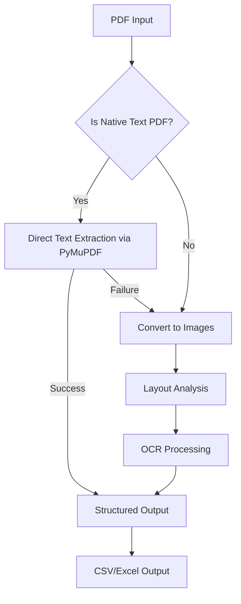

# Workflow Overview

This document summarizes the end-to-end processing pipeline for the **pdf-mining** project, reflecting the latest structure and refactors.

---

## 1. Input Phase

- **User Input:**  
  The pipeline is started via the CLI (`src/cli.py`) or programmatically, specifying PDF file(s) or directories.
- **Configuration:**  
  YAML files in `configs/` (e.g., `batch_config.yaml`, `ocr.yaml`) define extraction, OCR, and layout settings.

---

## 2. Preprocessing

| File                                 | Action                                             |
|-------------------------------------- |---------------------------------------------------|
| `src/preprocessing/pdf_to_image.py`   | Converts scanned/handwritten PDFs to images        |
| `src/preprocessing/image_tools.py`    | Enhances images for OCR (denoising, binarization)  |

---

## 3. Data Extraction

| File                                 | Action                                                      |
|-------------------------------------- |------------------------------------------------------------|
| `src/extraction/layout_analysis.py`   | Detects text regions (headings, paragraphs, tables) using LayoutParser/Donut |
| `src/extraction/text_extraction.py`   | Extracts text using PyMuPDF, Tesseract, or EasyOCR         |
| `src/extraction/table_handling.py`    | Reconstructs tables from OCR or PyMuPDF output             |

---

## 4. Stamp/Signature Handling

| File                                 | Action                                                      |
|-------------------------------------- |------------------------------------------------------------|
| `scripts/train_stamp_detector.py`     | (Optional) Trains YOLOv5 model for custom stamp detection   |
| `src/extraction/text_extraction.py`   | Filters out detected stamps/signatures using bounding boxes |

---

## 5. Postprocessing

| File                                         | Action                                         |
|---------------------------------------------- |------------------------------------------------|
| `src/postprocessing/text_cleaner.py`         | Removes OCR artifacts and gibberish text        |
| `src/postprocessing/structure_data.py`       | Organizes data into structured tables/paragraphs|

---

## 6. Output Generation

| File                                 | Action                                                      |
|-------------------------------------- |------------------------------------------------------------|
| `src/pipeline/batch_processor.py`     | Manages parallel processing and aggregates outputs          |
| `src/postprocessing/structure_data.py`| Exports structured data to CSV/Excel (data + images tabs)   |

---

## 7. Utilities & Error Handling

| File                                 | Action                                                      |
|-------------------------------------- |------------------------------------------------------------|
| `src/utils/retry.py`                  | Retries failed operations (e.g., OCR, PDF parsing)          |
| `src/utils/logger.py`                 | Logs progress, errors, and batch reports                    |
| `src/utils/config_loader.py`          | Loads and merges configuration files                        |

---

## End-to-End Flow



---

## Key Interactions

## Batch Processing

- `batch_processor.py` orchestrates parallel execution using `multiprocessing.Pool`, calling extraction and postprocessing modules for each file.

## Error Recovery

- `retry.py` wraps unstable operations (e.g., OCR, PDF parsing) with exponential backoff and logging.

---

## Project Structure

```mermaid
pdf-mining/
├── configs/
│   ├── batch_config.yaml      # Batch and extraction settings
│   └── ocr.yaml              # OCR engine settings
│
├── src/
│   ├── preprocessing/
│   │   ├── pdf_to_image.py
│   │   └── image_tools.py
│   │
│   ├── extraction/
│   │   ├── layout_analysis.py
│   │   ├── text_extraction.py
│   │   └── table_handling.py
│   │
│   ├── postprocessing/
│   │   ├── text_cleaner.py
│   │   └── structure_data.py
│   │
│   ├── pipeline/
│   │   └── batch_processor.py
│   │
│   └── utils/
│       ├── retry.py
│       ├── logger.py
│       └── config_loader.py
│
├── scripts/
│   ├── install_poppler.ps1
│   └── setup_tesseract.ps1
│
└── requirements.txt
```

---

## Configuration

- Settings from `configs/` are loaded by `config_loader.py` and injected into extraction, OCR, and layout modules.
- Command-line arguments (e.g., `--workers`, `--input`) override config file values.

---

## Output

- **Text Output:** `data/out/txt/{filename}.txt`
- **Structured CSV:** `data/out/csv/{filename}.csv`
- **Excel Output:** Data and images in separate tabs (if enabled)
- **Logs & Reports:** `data/out/logs/`
- **Signatures/Stamps:** Saved as images (if detected)

---

## Summary

The pipeline is modular, parallelized, and configurable, supporting robust extraction and structuring of data from diverse PDF types with detailed logging and error handling.
